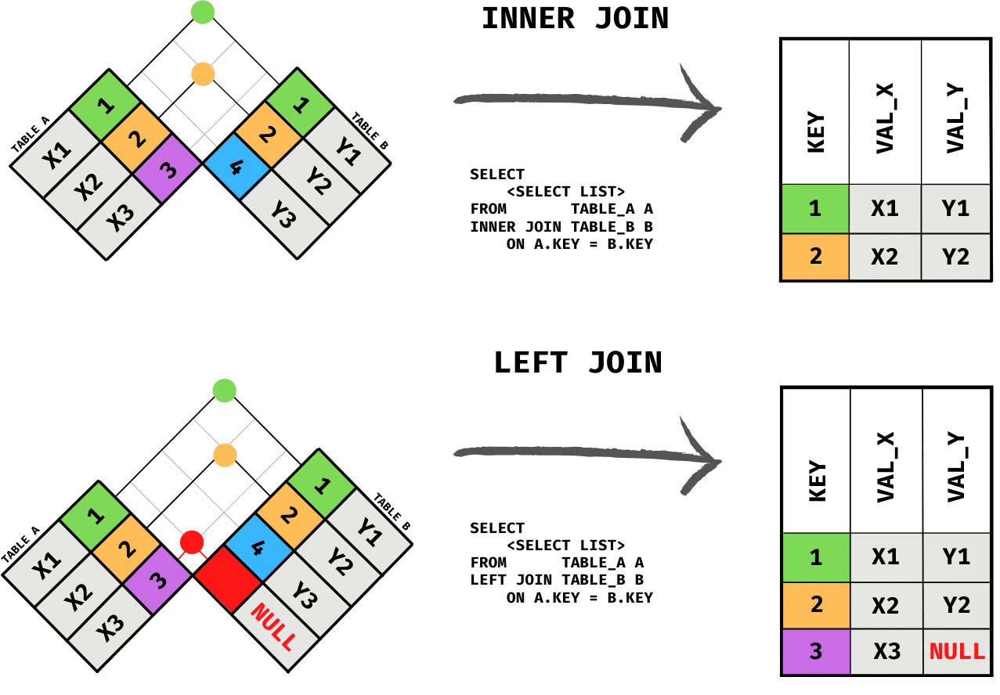

```{r setup, include=FALSE}
knitr::opts_chunk$set(echo = FALSE)
```

## Introducción

```{r bibliotecas, message=FALSE, warning=FALSE, include=FALSE, paged.print=FALSE}

packages <- c("tidyverse","RSQLite","knitr","kableExtra")
if (length(setdiff(packages, rownames(installed.packages()))) > 0) {
  install.packages(setdiff(packages, rownames(installed.packages())), repos = "http://cran.rstudio.com") 
}

sapply(packages, require, character.only=TRUE)

```

Iniciemos creando una conexión al archivo SQL

```{r conexion, echo=TRUE}
mydb <- dbConnect(RSQLite::SQLite(), "my-db.sqlite")
dbListTables(mydb)
dbListFields(mydb, "salesman")
```

## Tablas

```{r tablas1, echo=FALSE}
dbGetQuery(mydb, 'SELECT * FROM salesman') %>%
  kable(caption="salesman") %>%
  kable_styling(font_size = 5)
```


```{r tablas2, echo=FALSE}
dbGetQuery(mydb, 'SELECT * FROM customer') %>%
  kable(caption="customer") %>%
  kable_styling(font_size = 5)
```

##

```{r tablas3, echo=FALSE}
dbGetQuery(mydb, 'SELECT * FROM orders') %>%
  kable(caption="orders") %>%
  kable_styling(font_size = 5)
```


```{r tablas4, echo=FALSE}
dbGetQuery(mydb, 'SELECT * FROM company_mast') %>%
  kable(caption="company mast") %>%
  kable_styling(font_size = 5)
```


##

```{r tablas5, echo=FALSE}
dbGetQuery(mydb, 'SELECT * FROM item_mast') %>%
  kable(caption="item mast") %>%
  kable_styling(font_size = 5)
```


```{r tablas6, echo=FALSE}
dbGetQuery(mydb, 'SELECT * FROM emp_department') %>%
  kable(caption="emp department") %>%
  kable_styling(font_size = 5)
```

##

```{r tablas7, echo=FALSE}
dbGetQuery(mydb, 'SELECT * FROM emp_details') %>%
  kable(caption="emp details") %>%
  kable_styling(font_size = 5)
```


## SQL JOINS


{height=100%}

##

{height=100%}

##

{height=100%}

## Ejercicios

1.  From the following tables write a SQL query to find the salesperson and customer who reside in the same city. Return Salesman, cust_name and city. (salesman, customer)

2.  From the following tables write a SQL query to find those orders where the order amount exists between 500 and 2000. Return ord_no, purch_amt, cust_name, city. (orders, customer)

3.  From the following tables write a SQL query to find the salesperson(s) and the customer(s) he represents. Return Customer Name, city, Salesman, commission. (customer, salesman)

4.  From the following tables write a SQL query to find salespeople who received commissions of more than 12 percent from the company. Return Customer Name, customer city, Salesman, commission. (customer, salesman)

## 

5.  From the following tables write a SQL query to locate those salespeople who do not live in the same city where their customers live and have received a commission of more than 12% from the company. Return Customer Name, customer city, Salesman, salesman city, commission. (customer, salesman)

6.  From the following tables write a SQL query to find the details of an order. Return ord_no, ord_date, purch_amt, Customer Name, grade, Salesman, commission. (orders, customer, salesman)

7.  Write a SQL statement to join the tables salesman, customer and orders so that the same column of each table appears once and only the relational rows are returned. (orders, customer, salesman)

8.  From the following tables write a SQL query to display the customer name, customer city, grade, salesman, salesman city. The results should be sorted by ascending customer_id. (customer, salesman)

## 

9.  From the following tables write a SQL query to find those customers with a grade less than 300. Return cust_name, customer city, grade, Salesman, salesmancity. The result should be ordered by ascending customer_id. (customer, salesman)

10. Write a SQL statement to make a report with customer name, city, order number, order date, and order amount in ascending order according to the order date to determine whether any of the existing customers have placed an order or not. (orders, customer)

11. SQL statement to generate a report with customer name, city, order number, order date, order amount, salesperson name, and commission to determine if any of the existing customers have not placed orders or if they have placed orders through their salesman or by themselves. (customer, orders, salesman)

12. Write a SQL statement to generate a list in ascending order of salespersons who work either for one or more customers or have not yet joined any of the customers. (customer, salesman)

## 

13. From the following tables write a SQL query to list all salespersons along with customer name, city, grade, order number, date, and amount. (customer, salesman, orders)

14. Write a SQL statement to make a list for the salesmen who either work for one or more customers or yet to join any of the customer. The customer may have placed, either one or more orders on or above order amount 2000 and must have a grade, or he may not have placed any order to the associated supplier. (customer, salesman, orders)

15. For those customers from the existing list who put one or more orders, or which orders have been placed by the customer who is not on the list, create a report containing the customer name, city, order number, order date, and purchase amount. (customer, orders)

##

16. Write a SQL statement to generate a report with the customer name, city, order no. order date, purchase amount for only those customers on the list who must have a grade and placed one or more orders or which order(s) have been placed by the customer who neither is on the list nor has a grade. (customer, orders)

17. Write a SQL query to combine each row of the salesman table with each row of the customer table. (salesman, customer)

18. Write a SQL statement to create a Cartesian product between salesperson and customer, i.e. each salesperson will appear for all customers and vice versa for that salesperson who belongs to that city. (salesman, customer)

##

```{r cerrarconexion, echo=TRUE}
dbDisconnect(mydb)
```

**Referencias**:

- [Presentación: Introducción a SQL](https://www.cs.us.es/cursos/bd/temas/BD-Tema-5.pdf)
- [SQLite interface for R](https://rsqlite.r-dbi.org/)
- [SQL Tutorial](https://www.w3schools.com/sql/default.asp)
= [Curso Bienvenido a SQL | Khan Academy](https://es.khanacademy.org/computing/computer-programming/sql/sql-basics/v/welcome-to-sql)
- [SQL JOINS - Exercises, Practice](https://www.w3resource.com/sql-exercises/sql-joins-exercises.php)
- [Una hoja de atajos de SQL](https://learnsql.com/blog/sql-basics-cheat-sheet/sql-basics-cheat-sheet-letter.pdf)
