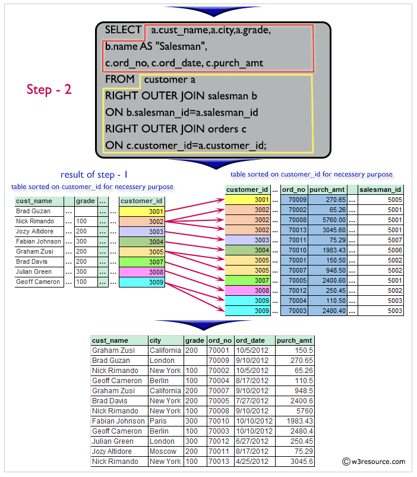

```{r setup, include=FALSE}
knitr::opts_chunk$set(echo = FALSE)
```

## Introducción

```{r bibliotecas, message=FALSE, warning=FALSE, include=FALSE, paged.print=FALSE}

packages <- c("tidyverse","RSQLite","knitr")
if (length(setdiff(packages, rownames(installed.packages()))) > 0) {
  install.packages(setdiff(packages, rownames(installed.packages())), repos = "http://cran.rstudio.com") 
}

sapply(packages, require, character.only=TRUE)

```

Iniciemos creando una conexión al archivo SQL

```{r conexion, echo=TRUE}
mydb <- dbConnect(RSQLite::SQLite(), "my-db.sqlite")
```

```{r listaTablas, echo=TRUE}
dbListTables(mydb)
```

```{r CamposSalesman, echo=TRUE}
dbListFields(mydb, "salesman")
```

## 

Ejecutamos la primer consulta

```{r consultasalesman, echo=TRUE}
dbGetQuery(mydb, 'SELECT * FROM salesman')
```

```{r consultacustomer, echo=TRUE}
dbGetQuery(mydb, 'SELECT * FROM customer')
```

```{r consultaorders, echo=TRUE}
dbGetQuery(mydb, 'SELECT * FROM orders')
```

```{r consultacompany_mast, echo=TRUE}
dbGetQuery(mydb, 'SELECT * FROM company_mast')
```

```{r consultaitem_mast, echo=TRUE}
dbGetQuery(mydb, 'SELECT * FROM item_mast')
```

```{r consultaemp_department, echo=TRUE}
dbGetQuery(mydb, 'SELECT * FROM emp_department')
```

```{r consultaemp_details, echo=TRUE}
dbGetQuery(mydb, 'SELECT * FROM emp_details')
```

Producto Cartesiano

Como

-   salesman tiene 6 filas y 4 columnas
-   customer tiene 8 filas y 5 columnas

el producto cartesiano tiene 48 (6 \* 8) filas y 9 (4 + 5) columnas.

```{r ProductoCartesiano, echo=TRUE}
dbGetQuery(mydb, 'SELECT * FROM salesman,customer')
```

## Ejercicios

1.  From the following tables write a SQL query to find the salesperson and customer who reside in the same city. Return Salesman, cust_name and city. (salesman, customer)

```{r e1, echo=TRUE}
dbGetQuery(mydb, 
'SELECT salesman.name AS "Vendedor",
customer.cust_name AS "Comprador", salesman.city AS "Ciudad"
FROM salesman,customer 
WHERE customer.city=salesman.city;
')
```


2.  From the following tables write a SQL query to find those orders where the order amount exists between 500 and 2000. Return ord_no, purch_amt, cust_name, city. (orders, customer)

```{r e2, echo=TRUE}
dbGetQuery(mydb, 
'SELECT  a.ord_no,a.purch_amt,
b.cust_name,b.city 
FROM orders a,customer b 
WHERE a.customer_id=b.customer_id 
AND a.purch_amt BETWEEN 500 AND 2000;
')
```

3.  From the following tables write a SQL query to find the salesperson(s) and the customer(s) he represents. Return Customer Name, city, Salesman, commission. (customer, salesman)

```{r e3, echo=TRUE}
dbGetQuery(mydb, 
'SELECT a.cust_name AS "Customer Name", 
a.city, b.name AS "Salesman", b.commission 
FROM customer a 
INNER JOIN salesman b 
ON a.salesman_id=b.salesman_id;
')
dbGetQuery(mydb, 
'SELECT a.cust_name AS "Customer Name", 
a.city, b.name AS "Salesman", b.commission 
FROM customer a ,salesman b 
WHERE a.salesman_id=b.salesman_id;
')
```

4.  From the following tables write a SQL query to find salespeople who received commissions of more than 12 percent from the company. Return Customer Name, customer city, Salesman, commission. (customer, salesman)

```{r e4, echo=TRUE}
dbGetQuery(mydb, 
'SELECT a.cust_name AS "Customer Name", 
a.city, b.name AS "Salesman", b.commission 
FROM customer a 
INNER JOIN salesman b 
ON a.salesman_id=b.salesman_id 
WHERE b.commission>.12;
')
```


5.  From the following tables write a SQL query to locate those salespeople who do not live in the same city where their customers live and have received a commission of more than 12% from the company. Return Customer Name, customer city, Salesman, salesman city, commission. (customer, salesman)

```{r e5, echo=TRUE}
dbGetQuery(mydb, 
'SELECT a.cust_name AS "Customer Name", 
a.city, b.name AS "Salesman", b.city,b.commission  
FROM customer a  
INNER JOIN salesman b  
ON a.salesman_id=b.salesman_id 
WHERE b.commission>.12 
AND a.city<>b.city;
')
```


6.  From the following tables write a SQL query to find the details of an order. Return ord_no, ord_date, purch_amt, Customer Name, grade, Salesman, commission. (orders, customer, salesman)

```{r e6, echo=TRUE}
dbGetQuery(mydb, 
'SELECT a.ord_no,a.ord_date,a.purch_amt,
b.cust_name AS "Customer Name", b.grade, 
c.name AS "Salesman", c.commission 
FROM orders a 
INNER JOIN customer b 
ON a.customer_id=b.customer_id 
INNER JOIN salesman c 
ON a.salesman_id=c.salesman_id;
')
dbGetQuery(mydb, 
'SELECT a.ord_no,a.ord_date,a.purch_amt,
b.cust_name AS "Customer Name", b.grade, 
c.name AS "Salesman", c.commission 
FROM orders a , customer b , salesman c 
WHERE a.customer_id=b.customer_id AND a.salesman_id=c.salesman_id;
')
```

 

7.  Write a SQL statement to join the tables salesman, customer and orders so that the same column of each table appears once and only the relational rows are returned. (orders, customer, salesman)

```{r e7, echo=TRUE}
dbGetQuery(mydb, 
'SELECT * 
FROM orders 
NATURAL JOIN customer  
NATURAL JOIN salesman;
')
```

 

8.  From the following tables write a SQL query to display the customer name, customer city, grade, salesman, salesman city. The results should be sorted by ascending customer_id. (customer, salesman)

```{r e8, echo=TRUE}
dbGetQuery(mydb, 
'SELECT a.cust_name,a.city,a.grade, 
b.name AS "Salesman",b.city 
FROM customer a 
LEFT JOIN salesman b 
ON a.salesman_id=b.salesman_id 
order by a.customer_id;
')
```


9.  From the following tables write a SQL query to find those customers with a grade less than 300. Return cust_name, customer city, grade, Salesman, salesmancity. The result should be ordered by ascending customer_id. (customer, salesman)

```{r e9, echo=TRUE}
dbGetQuery(mydb, 
'SELECT a.cust_name,a.city,a.grade, 
b.name AS "Salesman", b.city 
FROM customer a 
LEFT OUTER JOIN salesman b 
ON a.salesman_id=b.salesman_id 
WHERE a.grade<300 
ORDER BY a.customer_id;
')
```


10. Write a SQL statement to make a report with customer name, city, order number, order date, and order amount in ascending order according to the order date to determine whether any of the existing customers have placed an order or not. (orders, customer)

```{r e10, echo=TRUE}
dbGetQuery(mydb, 
'SELECT a.cust_name,a.city, b.ord_no,
b.ord_date,b.purch_amt AS "Order Amount" 
FROM customer a 
LEFT OUTER JOIN orders b 
ON a.customer_id=b.customer_id 
order by b.ord_date;
')
```


11. SQL statement to generate a report with customer name, city, order number, order date, order amount, salesperson name, and commission to determine if any of the existing customers have not placed orders or if they have placed orders through their salesman or by themselves. (customer, orders, salesman)

```{r e11, echo=TRUE}
dbGetQuery(mydb, 
'SELECT a.cust_name,a.city, b.ord_no,
b.ord_date,b.purch_amt AS "Order Amount", 
c.name,c.commission 
FROM customer a 
LEFT OUTER JOIN orders b 
ON a.customer_id=b.customer_id 
LEFT OUTER JOIN salesman c 
ON c.salesman_id=b.salesman_id;
')
```


12. Write a SQL statement to generate a list in ascending order of salespersons who work either for one or more customers or have not yet joined any of the customers. (customer, salesman)

```{r e12, echo=TRUE}
dbGetQuery(mydb, 
'SELECT a.cust_name,a.city,a.grade, 
b.name AS "Salesman", b.city 
FROM customer a 
RIGHT OUTER JOIN salesman b 
ON b.salesman_id=a.salesman_id 
ORDER BY b.salesman_id;
')
```


13. From the following tables write a SQL query to list all salespersons along with customer name, city, grade, order number, date, and amount. (customer, salesman, orders)

```{r e13, echo=TRUE}
dbGetQuery(mydb, 
'SELECT a.cust_name,a.city,a.grade, 
b.name AS "Salesman", 
c.ord_no, c.ord_date, c.purch_amt 
FROM customer a 
RIGHT OUTER JOIN salesman b 
ON b.salesman_id=a.salesman_id 
RIGHT OUTER JOIN orders c 
ON c.customer_id=a.customer_id;
')
```




14. Write a SQL statement to make a list for the salesmen who either work for one or more customers or yet to join any of the customer. The customer may have placed, either one or more orders on or above order amount 2000 and must have a grade, or he may not have placed any order to the associated supplier. (customer, salesman, orders)

```{r e14, echo=TRUE}
dbGetQuery(mydb, 
'SELECT a.cust_name,a.city,a.grade, 
b.name AS "Salesman", 
c.ord_no, c.ord_date, c.purch_amt 
FROM customer a 
RIGHT OUTER JOIN salesman b 
ON b.salesman_id=a.salesman_id 
LEFT OUTER JOIN orders c 
ON c.customer_id=a.customer_id 
WHERE c.purch_amt>=2000 
AND a.grade IS NOT NULL;
')
```


15. For those customers from the existing list who put one or more orders, or which orders have been placed by the customer who is not on the list, create a report containing the customer name, city, order number, order date, and purchase amount. (customer, orders)

```{r e15, echo=TRUE}
dbGetQuery(mydb, 
'SELECT a.cust_name,a.city, b.ord_no,
b.ord_date,b.purch_amt AS "Order Amount" 
FROM customer a 
LEFT OUTER JOIN orders b 
ON a.customer_id=b.customer_id;
')
```


16. Write a SQL statement to generate a report with the customer name, city, order no. order date, purchase amount for only those customers on the list who must have a grade and placed one or more orders or which order(s) have been placed by the customer who neither is on the list nor has a grade. (customer, orders)

```{r e16, echo=TRUE}
dbGetQuery(mydb, 
'SELECT a.cust_name,a.city, b.ord_no,
b.ord_date,b.purch_amt AS "Order Amount" 
FROM customer a 
FULL OUTER JOIN orders b 
ON a.customer_id=b.customer_id 
WHERE a.grade IS NOT NULL;
')
```


17. Write a SQL query to combine each row of the salesman table with each row of the customer table. (salesman, customer)

```{r e17, echo=TRUE}
dbGetQuery(mydb, 
'SELECT * 
FROM salesman a 
CROSS JOIN customer b;
')
```


18. Write a SQL statement to create a Cartesian product between salesperson and customer, i.e. each salesperson will appear for all customers and vice versa for that salesperson who belongs to that city. (salesman, customer)

```{r e18, echo=TRUE}
dbGetQuery(mydb, 
'SELECT * 
FROM salesman a 
CROSS JOIN customer b 
WHERE a.city IS NOT NULL;
')
```


```{r}
dbGetQuery(mydb, 
'SELECT a.salesman_id, a.name AS vendedor, SUM(purch_amt) as venta
FROM salesman a, orders b 
WHERE a.salesman_id =b.salesman_id
GROUP BY a.salesman_id
ORDER BY venta;
')

dbGetQuery(mydb, 
'SELECT a.city, SUM(purch_amt) as venta
FROM salesman a, orders b 
WHERE a.salesman_id =b.salesman_id
GROUP BY a.city
ORDER BY venta;
')
```

```{r cerrarconexion, echo=TRUE}
dbDisconnect(mydb)
```
